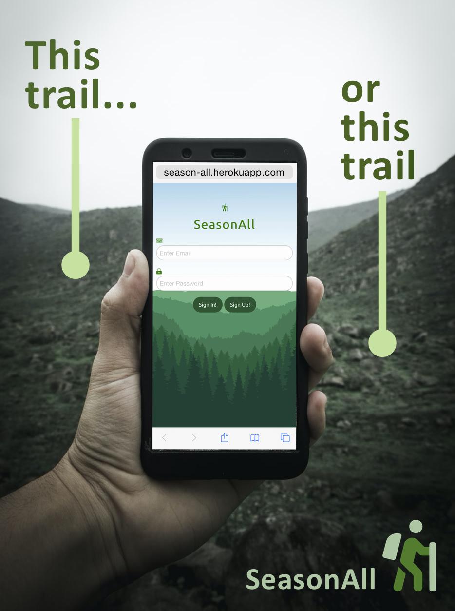

# Season All
  [](https://github.com/marshdugan)

## Table of Contents

  ## [Installation](#Installation) &nbsp;&bull;&nbsp; [Usage](#Usage) &nbsp;&bull;&nbsp; [License](#License) &nbsp;&bull;&nbsp; [Contributing](#Contributing) &nbsp;&bull;&nbsp; [Tests](#Tests) &nbsp;&bull;&nbsp; [Questions](#Questions)
  
## Description

This app allows user's to see nearby trails based on their current location.

## Description

This app allows user's to see nearby trails based on their current location.

## Installation
  To install necessary dependencies, run the following command:
  ```
  npm i
  ```

## Usage
  You user may need a .env file with a session key for salt hashing.

## License
  This project is licensed under the <a href="https://opensource.org/licenses/MIT">MIT license</a>

## Tests
  To run tests, run the following command:
  ```
  npm test
  ```
## Questions
  

  If you have any questions about the repo, open an issue or contact [walt ribeiro](https://api.github.com/users/waltribeiro) or send me an email at null;

